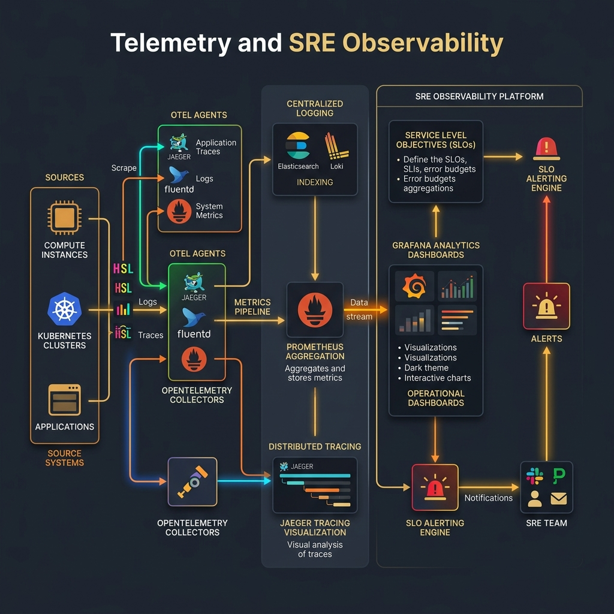

# 📈 Azure Monitor & Log Analytics Studio
> Configure enterprise diagnostic logs sinks. Generate Log Analytics workspaces templates, Kusto Query Language (KQL) SRE alert monitors, and diagnostic metrics bindings.

[](https://pradeeptalari14.github.io/portfolio/tools/azure-monitor/)
[]()

---

## 🎛️ How This Studio Works

Configure enterprise diagnostic logs sinks. Generate Log Analytics workspaces templates, Kusto Query Language (KQL) SRE alert monitors, and diagnostic metrics bindings.

Open the **[Interactive Studio](${studioUrl})** to configure options and generate files.
Each option combination produces different output — try different settings to learn by example.

## 🏗️ Architecture Flow Diagram



## 🚀 Step-by-Step Onboarding & Validation Guide

Follow these SRE steps to deploy, validate, and monitor this repository's workspace configs in a local or production environment:

#### 1. Prerequisites
- [x] **Docker Engine**
- [x] **Prometheus & Grafana binaries**
- [x] **OpenTelemetry Collector (optional)**

#### 2. Download
Clone this repository locally:
```bash
git clone https://github.com/Pradeeptalari14/tp-azure-monitor.git
cd tp-azure-monitor
```

#### 3. Install
Fetch required packages and compile environment binaries:
```bash
docker compose pull || pip install prometheus_client opentelemetry-api
```

#### 4. Enable Automatic Sidecar Injection
Deploy OpenTelemetry Collector sidecar alongside application pods to scrape metrics and trace requests.

#### 5. Install Kubernetes Gateway API CRDs
Install Gateway API metrics routing rules to monitor gateway ingress profiles:
```bash
kubectl apply -f https://raw.githubusercontent.com/kubernetes-sigs/gateway-api/v1.1.0/config/crd/standard/gateway-api-v1.1.0-experimental.yaml
```

#### 6. Deploy Application Workload
Launch the observability monitoring components stack:
```bash
docker compose up -d prometheus grafana otel-collector
```

#### 7. Validate Application Inside Cluster
Verify Prometheus scrape targets are active and healthy:
```bash
curl -s http://localhost:9090/api/v1/targets | grep -o '"health":"up"'
```

#### 8. Expose Application Using Gateway
Expose Grafana dashboard page or Prometheus server endpoint:
```bash
kubectl port-forward svc/grafana 3000:3000
```

#### 9. Access the Application
Access dashboards at [http://localhost:3000](http://localhost:3000). Default auth: `admin/admin`.

#### 10. Install Addons
Deploy Node Exporter, kube-state-metrics, Jaeger trace collector, and Alertmanager notification hubs.

#### 11. Access Dashboard
Access Grafana panels on port 3000 or Prometheus query console page on port 9090.

#### 12. View Service Mesh Graph
View service mesh graphs in Kiali, Jaeger call trees trace charts, or Grafana dashboards panels.

#### 13. Generate Traffic
Generate request load and metrics variables:
```bash
for i in {1..50}; do curl -s http://localhost:8080/metrics > /dev/null; sleep 0.2; done
```

#### 14. Project Structure
```text
tp-tp-azure-monitor/
├── .gitignore                # Version control exclusions
├── LICENSE                   # MIT Open Source License
├── SECURITY.md               # Vulnerability reporting protocols
├── CHANGELOG.md              # Releases version history
├── README.md                 # Project learning guide & onboarding
├── .env.example              # Template parameters config
├── .pre-commit-config.yaml   # Gitleaks & lint pipeline hooks
├── docs/
│   ├── USAGE.md              # Extended developer usage docs
│   ├── TROUBLESHOOTING.md    # Failures resolution guide
│   ├── GLOSSARY.md           # SRE domain terminology index
│   ├── COMPLIANCE.md         # Legal and security checks checklist
│   └── sre_architecture_flow.png # Category SRE architecture diagram
├── scripts/
│   └── validate.sh           # Local validation helper script
└── .github/
    ├── CONTRIBUTING.md       # Contributing instructions
    ├── PULL_REQUEST_TEMPLATE.md # Pull request code compliance check
    ├── ISSUE_TEMPLATE/       # Bug and features tickets
    ├── dependabot.yml        # Auto updates dependencies
    └── workflows/
        └── security-scan.yml # Gitleaks/yamllint/shellcheck scans

# Primary Config File: monitor_rules.tf
```

#### 15. Observability Components
Exports telemetry collection states: metrics ingestion rates, active scraping latency, and active alerting rule hits.

#### 16. Install Monitoring
Triggers notification routing (PagerDuty, Slack, Email) when Service Level Objectives (SLOs) are breached.

## 🔐 Security

- ❌ Never commit real credentials
- ✅ Use environment variables or secret managers
- ✅ Enable branch protection on `main`

## 📖 Resources

| Resource | Link |
|----------|------|
| Interactive Studio | [Open →](https://pradeeptalari14.github.io/portfolio/tools/azure-monitor/) |
| All 91 Studios | [Dashboard →](https://pradeeptalari14.github.io/portfolio/tools/) |

*Part of [Talari Pradeep Developer Studio Portfolio](https://pradeeptalari14.github.io/portfolio)*